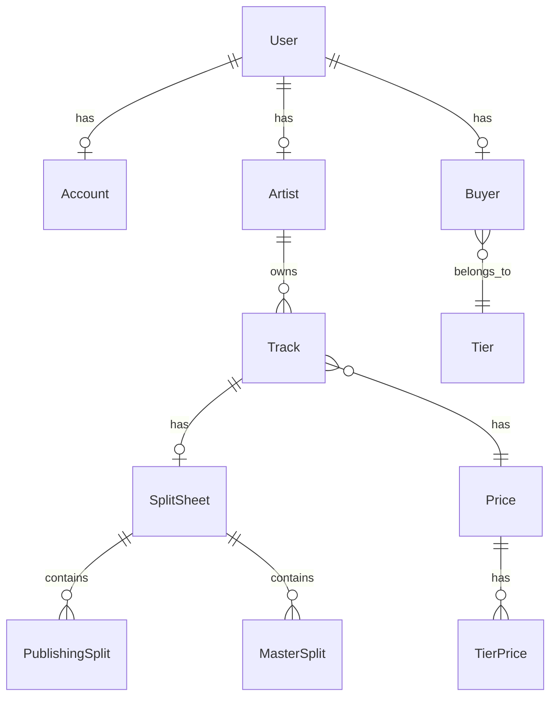

# Acrylic Platform - Developer Documentation

## Overview

Acrylic Platform is a Django-based web backend application that facilitates music licensing between artists and buyers. The platform allows artists to upload their tracks, manage licensing terms, and handle split sheets for royalty distribution, while buyers can browse, license, and purchase music for various uses. The application exposes an API that is used by the frontend web application.

- Acrylic Back Office: https://platform.acrylic.la/admin
- Acrylic API: https://platform.acrylic.la/api/v1/schema/swagger/


## Table of Contents

- [Project Architecture](#project-architecture)
- [Installation & Setup](#installation--setup)
- [Project Structure](#project-structure)
- [Core Applications](#core-applications)
- [API Documentation](#api-documentation)
- [Database Models](#database-models)
- [Authentication & Authorization](#authentication--authorization)
- [File Storage](#file-storage)
- [External Integrations](#external-integrations)
- [Background Tasks](#background-tasks)
- [Development Guidelines](#development-guidelines)
- [Deployment](#deployment)

## Project Architecture

### Technology Stack

- **Backend Framework**: Django 5.0.6
- **API Framework**: Django REST Framework 3.14.0
- **Database**: PostgreSQL (production) / SQLite (development)
- **Authentication**: JWT tokens, Social Auth (Spotify, Facebook, Google)
- **File Storage**: AWS S3
- **Email**: AWS SES
- **Background Tasks**: Celery with Redis
- **API Documentation**: drf-spectacular (OpenAPI/Swagger)
- **Frontend Integration**: CORS-enabled for Angular frontend

### System Architecture

```
┌─────────────────┐    ┌──────────────────┐    ┌─────────────────┐
│   Angular       │    │   Django REST    │    │   PostgreSQL    │
│   Frontend      │◄──►│   API Backend    │◄──►│   Database      │
│   (External)    │    │                  │    │                 │
└─────────────────┘    └──────────────────┘    └─────────────────┘
                                │
                                ▼
                       ┌──────────────────┐
                       │   External APIs  │
                       │   - Spotify      │
                       │   - Chartmetric  │
                       │   - SignWell     │
                       │   - HubSpot      │
                       └──────────────────┘
```

## Installation & Setup

### Prerequisites

- Python 3.11+
- PostgreSQL (for production)
- Redis (for Celery)
- AWS Account (for S3 storage and SES email)

### Local Development Setup

1. **Clone the repository**
   ```bash
   git clone <repository-url>
   cd acrylic
   ```

2. **Create virtual environment**
   ```bash
   python -m venv venv
   source venv/bin/activate  # On Windows: venv\Scripts\activate
   ```

3. **Install dependencies**
   ```bash
   pip install -r requirements.txt
   ```

4. **Environment Configuration**
   Create a `.env` file in the project root:
   ```env
   SECRET_KEY=your-secret-key
   DEBUG=True
   DATABASE_URL=sqlite:///db.sqlite3

   # AWS Configuration
   AWS_ACCESS_KEY_ID=your-aws-access-key
   AWS_SECRET_ACCESS_KEY=your-aws-secret-key
   AWS_STORAGE_BUCKET_NAME=your-s3-bucket
   AWS_S3_REGION_NAME=us-east-1

   # Email Configuration
   EMAIL_HOST=your-smtp-host
   EMAIL_HOST_USER=your-email-user
   EMAIL_HOST_PASSWORD=your-email-password
   EMAIL_FROM=noreply@acrylic.la

   # External API Keys
   SPOTIFY_CLIENT_ID=your-spotify-client-id
   SPOTIFY_CLIENT_SECRET=your-spotify-client-secret
   CHARTMETRIC_REFRESH_TOKEN=your-chartmetric-token
   SIGNWELL_API_KEY=your-signwell-api-key
   HUBSPOT_ACCESS_TOKEN=your-hubspot-token
   ```

5. **Database Setup**
   ```bash
   python manage.py migrate
   python manage.py createsuperuser
   ```

6. **Run Development Server**
   ```bash
   python manage.py runserver
   ```

7. **Access the Application**
   - Admin Panel: http://127.0.0.1:8000/admin/
   - API Documentation: http://127.0.0.1:8000/api/v1/schema/swagger/

## Project Structure

```
acrylic/
├── account/           # User accounts and authentication
├── artist/            # Artist profiles and management
├── buyer/             # Buyer profiles and tiers
├── catalog/           # Music catalog (tracks, genres, pricing)
├── legal/             # Split sheets and contracts
├── content/           # CMS content (articles)
├── common/            # Shared utilities and base models
├── chartmetric/       # Chartmetric API integration
├── spotify/           # Spotify API integration
├── billing/           # Billing and payments (future)
├── distributor/       # Music distributors (future)
├── acrylic/           # Django project settings
├── staticfiles/       # Static files
├── documents/         # File uploads
└── docs/              # Project documentation
```

## Core Applications

### Account App
**Purpose**: User account management, authentication, and document handling

**Key Models**:
- `Account`: Extended user profile with billing information
- `Document`: File uploads with digital signature support
- `Invitation`: User invitation system

**Key Features**:
- JWT authentication
- Social authentication (Spotify, Facebook, Google)
- Document management with SignWell integration
- User registration and email verification

### Artist App
**Purpose**: Artist profile management and statistics

**Key Models**:
- `Artist`: Artist profiles with social media links and statistics

**Key Features**:
- Artist profile creation and management
- Social media integration
- Spotify and Chartmetric statistics tracking
- Automatic slug generation for public profiles
- KAMRank ranking system

### Catalog App
**Purpose**: Music catalog management and pricing

**Key Models**:
- `Track`: Music tracks with metadata and files
- `Genre`: Music genres
- `Price`: Pricing tiers for tracks
- `TierPrice`: Tier-specific pricing
- `SyncList`: Curated track collections
- `Distributor`: Music distribution companies

**Key Features**:
- Track upload and metadata management
- Multi-file support (WAV, MP3, snippets)
- Genre and tag management
- Dynamic pricing based on buyer tiers
- Sync lists for playlist-like collections
- Automatic Spotify/Chartmetric ID resolution

### Buyer App
**Purpose**: Music buyer management and access control

**Key Models**:
- `Buyer`: Buyer profiles
- `Tier`: Buyer access tiers

**Key Features**:
- Tier-based access control
- Dynamic pricing based on tier level

### Legal App
**Purpose**: Split sheet management and digital signatures

**Key Models**:
- `SplitSheet`: Revenue split agreements
- `PublishingSplit`: Publishing rights splits
- `MasterSplit`: Master recording splits

**Key Features**:
- Digital signature workflow via SignWell
- Publishing and master rights management
- Automatic signature request generation
- Webhook handling for signature updates

## API Documentation

### Base URL
- **Production**: `https://platform.acrylic.la/api/v1/`
- **Development**: `http://127.0.0.1:8000/api/v1/`

### Authentication

The API uses JWT (JSON Web Tokens) for authentication:

```bash
# Obtain token
POST /api/v1/auth/token/
{
  "email": "user@example.com",
  "password": "password"
}

# Use token in subsequent requests
Authorization: Bearer <access_token>
```

### Key Endpoints

#### Public Endpoints
- `GET /artists/` - List artists
- `GET /tracks/` - List tracks
- `GET /genres/` - List genres
- `GET /synclists/` - List sync lists
- `GET /prices/` - List pricing tiers

#### Artist Endpoints (Authenticated)
- `GET /my-artist/` - Artist profile
- `GET/POST /my-artist/tracks/` - Artist's tracks
- `GET/POST /my-artist/synclists/` - Artist's sync lists
- `GET/POST /my-artist/split-sheets/` - Artist's split sheets

#### Account Endpoints (Authenticated)
- `GET/PUT /account/` - User account
- `GET/POST /account/documents/` - User documents

### API Schema
Full API documentation is available at `/api/v1/schema/swagger/` when running the development server.

## Database Models

### Base Model
All models inherit from `BaseModel` which provides:
- `uuid`: UUID primary key
- `created`: Timestamp of creation
- `updated`: Timestamp of last update
- Automatic indexing on UUID, created, and updated fields

### Key Relationships



### Data Validation
- ISRC codes are validated using custom validators
- Email fields use Django's built-in email validation
- Percentage fields are validated to ensure they sum to 100%

## Authentication & Authorization

### Authentication Methods
1. **JWT Tokens**: Primary authentication method
2. **Social Auth**: Integration with Spotify, Facebook, Google
3. **Email/Password**: Traditional authentication

### Permission System
- **IsAuthenticated**: Required for most endpoints
- **Custom Permissions**: Artist-specific and buyer-specific views
- **Admin Permissions**: Django admin interface

### User Types
Users can have multiple roles:
- **Artist**: Can upload tracks and manage split sheets
- **Buyer**: Can license tracks based on tier
- **Admin**: Full system access

## File Storage

### AWS S3 Integration
- **Default Storage**: Private S3 bucket for user uploads
- **Public Storage**: Public S3 bucket for publicly accessible files
- **Static Files**: Served via WhiteNoise in production

### File Types
- **Audio Files**: WAV, MP3 (tracks and snippets)
- **Images**: Artist photos, track covers, sync list covers
- **Documents**: PDFs, contracts, split sheets

### File Upload Process
1. Files are uploaded directly to S3 via `s3file` middleware
2. Database records store S3 file paths
3. Presigned URLs provide secure temporary access

## External Integrations

### Spotify API
- **Purpose**: Track metadata enrichment, artist statistics
- **Implementation**: `spotify/` app with async tasks
- **Data Sync**: Automatic track ID resolution and metadata updates

### Chartmetric API
- **Purpose**: Music industry analytics and statistics
- **Implementation**: `chartmetric/` app with periodic data updates
- **Data Tracked**: Follower counts, popularity metrics

### SignWell (Digital Signatures)
- **Purpose**: Legal document signing workflow
- **Implementation**: `legal/` app with webhook handling
- **Process**: Document generation → Signature request → Webhook updates

### HubSpot CRM
- **Purpose**: Customer relationship management
- **Implementation**: Artist profile synchronization
- **Data Sync**: Artist contact information and engagement tracking

## Background Tasks

### Celery Configuration
Background tasks are handled by Celery with Redis as the message broker.

### Task Categories

#### Data Synchronization Tasks
- `load_spotify_id`: Resolve Spotify IDs for tracks
- `load_chartmetric_ids`: Resolve Chartmetric IDs
- `update_kamrank`: Update artist ranking

#### Legal Process Tasks
- `request_signatures_task`: Send signature requests via SignWell
- `split_sheet_load_spotify_data_task`: Load track data for split sheets

#### Notification Tasks
- Email notifications for various events
- Webhook processing tasks

### Running Celery
```bash
# Start Celery worker
celery -A acrylic worker -l info

# Start Celery beat (for scheduled tasks)
celery -A acrylic beat -l info
```

## Development Guidelines

### Model Guidelines
- Always inherit from `BaseModel` for new models
- Add appropriate indexes for performance
- Use descriptive field names and help text
- Implement `__str__` methods for all models

### API Guidelines
- Use Django REST Framework serializers
- Implement proper permission classes
- Add pagination for list endpoints
- Include comprehensive API documentation


## Deployment

### Heroku Deployment

The application is configured for Heroku deployment with:

1. **Procfile**: Defines web and worker processes
2. **runtime.txt**: Specifies Python version
3. **django-heroku**: Automatic Heroku configuration
4. **Gunicorn**: WSGI server for production

### Environment Variables

Required production environment variables:
```env
SECRET_KEY=production-secret-key
DEBUG=False
DATABASE_URL=postgresql://...
SENTRY_DSN=https://...
AWS_ACCESS_KEY_ID=...
AWS_SECRET_ACCESS_KEY=...
# ... (all other environment variables from development)
```

### Database Migrations
```bash
# Run migrations on deployment
heroku run python manage.py migrate

# Create superuser (if needed)
heroku run python manage.py createsuperuser
```

### Monitoring

- **Error Tracking**: Sentry integration for error monitoring
- **Logs**: Heroku logs for application monitoring
